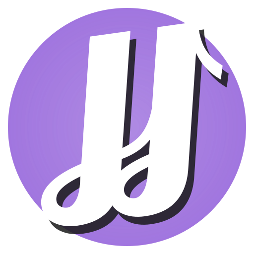

<h1 align="center">Podds</h1>
<p align="center">
  
</p>
<p align="center">
  <a href="https://podds.io">podcasts, simple and free</a>
</p>

---

## Table of Contents

- [What is Podds?](#what-is-podds)
- [Videos and Screenshots](#videos-and-screenshots)
- [Tech Stack](#tech-stack)
- [CORS Proxies](#cors-proxies)
- [Sharing](#sharing)
- [Inspired By](#inspired-by)

## What is Podds?

[Podds](https://podds.io) is a local-first podcast web app geared towards simplicity, speed, and sharing. I built it as a weekend project that took 6 months, as is tradition.

There's no ads, no signups or accounts, no app stores or gatekeepers, no SaaS or costs.  Instead, Podds runs on your device and uses the open web for easy distribution ✨

You can [import](https://podds.io/settings?section=basic#import) podcasts from another app or use the [search](https://podds.io/search) page to find podcasts and episodes.  

Podds takes care of the rest - finding new episodes, handling downloads and playback, saving searches, chapter support, and so on.  All of your data stays on your device.

**Try it out at [podds.io](https://podds.io)**

## Videos and Screenshots

<video src="https://github.com/user-attachments/assets/9e9b03a6-6ab9-4096-a2de-3410d64ecb04"></video>
</img>
</img>
</img>
</img>

## Tech Stack

Podds is a [Progressive Web Application (PWA)](https://en.wikipedia.org/wiki/Progressive_web_app) and [Single-page Application (SPA)](https://en.wikipedia.org/wiki/Single-page_application) geared towards mobile devices.  It is hosted for free on Cloudflare Pages.

### Data

- [SignalDB](https://signaldb.js.org/)
- [fast-xml-parser](https://github.com/NaturalIntelligence/fast-xml-parser)
- [CORS Proxies](https://httptoolkit.com/blog/cors-proxies/)
- [iTunes Search API](https://performance-partners.apple.com/search-api)

### UI

- [Svelte](https://svelte.dev/)
- [Svelte Bottom Sheet](https://github.com/AuxiDev/svelte-bottom-sheet)
- [Lucide Icons](https://lucide.dev/)
- [Pattern Monster](https://pattern.monster/)
- [text divider](https://thenounproject.com/browse/icons/term/text-divider) by iconcheese from the Noun Project

## CORS Proxies

> CORS proxies help web apps get equal-footing with native apps (Android, iOS), especially web apps that need to fetch third-party data, like a podcast app!

Podds is configured with two [CORS proxies](https://httptoolkit.com/blog/cors-proxies/) - a primary and (optional) backup.  They help Podds sync podcast feeds, download artwork and audio files, and search iTunes for feeds and episodes.

Without CORS proxies, the browser will block network requests to other servers unless they allow CORS.  In practice, most podcast servers do not allow CORS.

### Default Proxies

By default, Podds ships with CORS proxies that I manage.  The primary is a [Cloudflare Worker](cors-proxies/cloudflare/worker.js) and the backup is in [Node](cors-proxies/node/server.js) and self-hosted.  

You're welcome to use my proxies!  I will try to keep the lights on, one way or another, and adapt + improve the proxies as I go.

### Bring Your Own Proxy

You can easily create and use your own CORS proxies with Podds, which I recommend for a few reasons.

🔒 **[Privacy](https://www.inkandswitch.com/essay/local-first/#6-security-and-privacy-by-default)** => when you use a public proxy, its owner can see and modify the traffic between you and the target servers.  Running your own CORS proxy eliminates that risk and gives you agency.

📜 **[The Long Now](https://www.inkandswitch.com/essay/local-first/#5-the-long-now)** => maybe my CORS proxies hit quotas or fall over, maybe free tiers go away, maybe I'm hit by a bus while listening to a podcast.  None of that should prevent you from continuing to use Podds.

🚲 **It's Easy** => the [Cloudflare Worker](#the-cloudflare-worker-way) way is free and takes a few minutes.  The steps below handhold you through it.

### The Cloudflare Worker Way

> zero-cost, no credit card, email verification

#### Create Account

Create a [Cloudflare account](https://dash.cloudflare.com/sign-up) and do the email verification.  The dashboard won't be usable until you do the email verification.

#### Create Worker

From the dashboard, go to _Compute (Workers)_ and click Create.  Choose the _Start with Hello World_ template. Then click _Edit Code_ and paste in this [worker.js](/cors-proxies/cloudflare/worker.js) script.  

In the worker's settings, you'll find its URL under _Domains & Routes_, i.e. `<worker>.<account-name>.workers.dev`.  This URL is also shown when you create the worker initially.

#### Configure Podds

On the [Podds advanced settings page](https://podds.io/settings?section=advanced), copy+paste your worker's URL as the primary or backup CORS proxy.  Dunzo.

### The Self-Hosted Way

This repo contains an equivalent [NodeJS app](/cors-proxies/node/server.js) and [Dockerfile](/cors-proxies/node/Dockerfile). Plumbing out to the internet is left as an exercise for the self-hoster.  

Some good resources

- [awesome-selfhosted](https://github.com/awesome-selfhosted/awesome-selfhosted)
- [r/selfhosted](https://www.reddit.com/r/selfhosted/)

## Sharing

Podds makes it easy to share podcasts and episodes via links.  Where supported, the [Web Share API](https://developer.mozilla.org/en-US/docs/Web/API/Web_Share_API) is used for rich, app-like sharing, e.g. QR code on Android.

If you configure [custom CORS proxies](#bring-your-own-proxy), they are included in the share links.  When the lucky recipient clicks the link, Podds will update their CORS proxy settings.

The sharing information is encoded in the [URI fragment](https://en.wikipedia.org/wiki/URI_fragment), which is processed client-side but not sent to the server.  In other words, everything after the `#` symbol stays on your device.

```bash
https://podds.io/share#1725721050
https://podds.io/share#1725721050+1748258874
https://podds.io/share#1725721050+1748258874+yolo-cors.whatever.biz
```

### Android

Share links open quite nicely on Android.  

They open the Podds app if installed, and in the default browser otherwise.  Podds is usable in the browser, as [IndexedDB](https://web.dev/articles/indexeddb) and the [Cache API](https://developer.mozilla.org/en-US/docs/Web/API/Cache) are shared between the browser and the app.  You can switch between the browser and app without any issues.

<video src="https://github.com/user-attachments/assets/60a38e6f-b4da-44a4-bc31-d13968df8362"></video>

### iOS

[Apple does not like the web](https://open-web-advocacy.org/walled-gardens-report/#apple-is-holding-back-the-open-web) and web developers and users suffer because of it, by design.

In terms of Podds, there are two roadblocks on iOS specifically

1. share links open Podds in Safari even if you have installed the Podds app
2. **Nothing** is shared between the Safari and app versions of Podds.

Together, this results in a disjointed experience for the user, in a way that makes the Podds look broken.

Podds addresses these roadblocks by treating Safari and the app versions differently.  The Safari version is limited to two things

1. help the user install the app
2. show a _Share with app_ button which copies the share link to the clipboard

The app version of Podds has a Receive button that pastes the clipboard, and then loads the share page.  

<video src="https://github.com/user-attachments/assets/22498dbd-bb8f-478a-96e9-08350a629aa5"></video>

## Inspired By

- [Maggie Appleton - Home-Cooked Software and Barefoot Developers](https://maggieappleton.com/home-cooked-software)
- [Open Web Advocacy - Walled Gardens Report](https://open-web-advocacy.org/walled-gardens-report/)
- [Johannes Schickling - local-first podcast](https://www.localfirst.fm/)
- [SLC - Simple, Lovable, Complete](https://longform.asmartbear.com/slc/)
- [Linear](https://linear.app)
